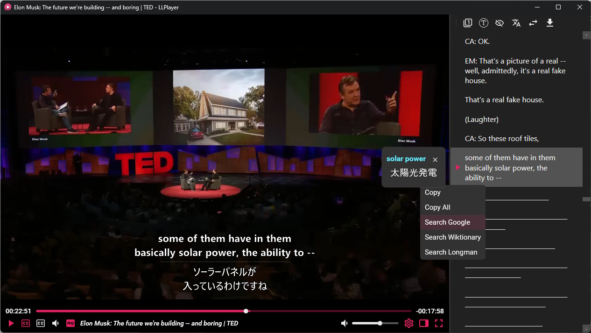

<p align="center"></p>

<h1 align="center">LLPlayer</h1>

<h3 align="center">The media player for language learning.</h3>

<p align="center">A video player focused on subtitle-related features such as dual subtitles, AI-generated subtitles, real-time OCR, real-time translation, word lookup, and more!</p>

<p align="center">
<a href="https://llplayer.com">Website</a> ·
<a href="https://github.com/umlx5h/LLPlayer/releases">Releases</a>
</p>

---

## 🎬 Demo

https://github.com/user-attachments/assets/05a7b451-ee3b-489f-aac9-f1670ed76e71

[TED Talk - The mind behind Linux](https://www.ted.com/talks/linus_torvalds_the_mind_behind_linux)

## ✨ Features

LLPlayer has many features for language learning that are not available in normal video players.

- **Dual Subtitles:** Two subtitles can be displayed simultaneously. Both text subtitles and bitmap subtitles are supported.
- **AI-generated subtitles (ASR):** Real-time automatic subtitle generation from any video and audio, powered by [OpenAI Whisper](https://github.com/openai/whisper). **99** languages are supported!
- **Real-time Translation:** Supports Google and DeepL API, **134** languages are currently supported!
- **Real-time OCR subtitles:** Can convert bitmap subtitles to text subtitles in real time, powered by [Tesseract OCR](https://github.com/tesseract-ocr/tesseract) and Microsoft OCR.
- **Subtitles Sidebar:** Both text and bitmap are supported. Seek and word lookup available. Has anti-spoiler functionality.
- **Instant word lookup:** Word lookup and browser searches can be performed on subtitle text.
- **Customizable Browser Search:** Browser searches can be performed from the context menu of a word, and the search site can be completely customized.
- **Plays online videos:** With [yt-dlp](https://github.com/yt-dlp/yt-dlp) integration, any online video can be played back in real time, with AI subtitle generation, word lookups!
- **Flexible Subtitles Size/Placement Settings:** The size and position of the dual subtitles can be adjusted very flexibly.
- **Subtitles Seeking for any format:** Any subtitle format can be used for subtitle seek.
- **Built-in Subtitles Downloader:** Supports opensubtitles.org
- **Integrate with browser extensions:** Can work with any browser extensions, such as [Yomitan](https://github.com/yomidevs/yomitan) and [10ten](https://github.com/birchill/10ten-ja-reader).
- **Customizable Dark Theme:** The theme is based on black and can be customized.
- **Fully Customizable Shortcuts:** All keyboard shortcuts are fully customizable. The same action can be assigned to multiple keys!
- **Built-in Cheat Sheet:** You can find out how to use the application in the application itself.
- **Free, Open Source, Written in C#:** Written in C#/WPF, not C, so customization is super easy!

## 🖼️ Screenshot



[TED Talk - The mind behind Linux](https://www.ted.com/talks/linus_torvalds_the_mind_behind_linux)

## ✅ Requirements

[OS]
* Windows 10 x64, Version 1903 later
* Windows 11 x64

[Pre-requisites]
* [.NET Desktop Runtime 9](https://dotnet.microsoft.com/en-us/download/dotnet/9.0)
  * If not installed, a installer dialog will appear
* [Microsoft Visual C++ Redistributable Version >= 2022](https://learn.microsoft.com/en-us/cpp/windows/latest-supported-vc-redist?view=msvc-170#latest-microsoft-visual-c-redistributable-version) (for Whisper ASR, Tesseract OCR)
  * Note that if this is not installed, the app will launch, but **will crash when ASR or OCR is enabled**!

## 🚀 Getting Started

1. **Download builds from [release](https://github.com/umlx5h/LLPlayer/releases)**

2. **Launch LLPlayer**

Please open `LLPlayer.exe`.

3. **Open Settings**

Press `CTRL+.` or click the settings icon on the seek bar to open the settings window.

4. **Download Whisper Model for ASR**

From `Subtitles > ASR` section, please download Whisper's models.
You can choose from a variety of models, the larger the size, the higher the load and accuracy.

Note that models with `En` endings are only available in English.

`Audio Language` allows you to manually set the language of the video (audio). The default is auto-detection.

5. **Set Translation Target Language**

To use the translation function, please set your native language. This is called the `target language`.
The `source language` is detected automatically.

From `Subtitles > Translate` section, please set the `Target Language` at the top.

The default translation engine is `Google Translate`.

You can change it to `DeepL` from the settings below, but you will need to configure API key. (free for a certain amount of use)

6. **Play any videos with subtitles!**

You can play it from the context menu or by dropping the video.

For online videos, you can also play it by pasting the URL with `CTRL+V` or from context menu.

There are two `CC` buttons on the bottom seek bar.

The left is the primary subtitle and the right is the secondary subtitle.
Please set your learning language for the primary subtitle and your native language for the secondary subtitle.

Adding external subtitles is done in the same way as for videos, either by dragging or from the context menu.

7. **Open CheatSheet**

You can open a built-in CheatSheet by pressing `F1` or from ContextMenu.

All keyboard and mouse controls are explained.
Keyboard controls are fully customizable from the settings.

## ❤️ Development Status

Status: `Beta`  

It has not yet been tested by enough users and may be unstable.

Significant changes may be made to the UI and settings.  
I will actively make breaking changes during version `0.X.X`.

(Configuration files may not be backward compatible when updated.)

## 🔨 Build

1. **Clone the Repository**

```bash
$ git clone git@github.com:umlx5h/LLPlayer.git
```

2. **Open Project**

Install Visual Studio or JetBrains Rider and open the following sln file.

```bash
$ ./LLPlayer.sln
```

3. **Build**

Select `LLPlayer` project and then build and run.

## 🚩 Roadmaps

Guiding Principles for LLPlayer

* Be a specialized player for language learning, not a general-purpose player
  * So not to be a replacement for mpv or VLC
* Support as many languages as possible
* Provide some language-specific features as well

### Now

- [ ] Improve core functionality
  - [ ] ASR
    - [X] Enable ASR subtitles with dual subtitles (one of them as translation)
    - [ ] Pause and resume
    - [ ] More natural sentence splitting (try [echosharp](https://github.com/sandrohanea/echosharp)?)

  - [ ] Subtitles
    - [ ] Customize language preference for primary and secondary subtitles, respectively, and automatic opening
    - [ ] Enhanced local subtitle search
    - [X] [Export ASR/OCR subtitle results to SRT file](https://github.com/umlx5h/LLPlayer/issues/12)

- [ ] Stabilization of the application
- [ ] Allow customizable mouse shortcuts
- [ ] Documentation / More Help

### Later

- [ ] Support for dictionary API or for specific languages (English, Japanese, ...)
- [ ] Dedicated support for Japanese for watching anime.
  - [ ] Word Segmentation Handling
  - [ ] [Incorporate Yomitan or 10ten to video player](https://github.com/umlx5h/LLPlayer/issues/13)
- [ ] Text-to-Speech integration
- [ ] More translation engine such as local LLM
  - [ ] Support translation as plugin?

### Future

- [ ] Cross-Platform Support using Avalonia (Linux / Mac)
- [ ] Context-Aware Translation
- [ ] Word Management (reference to LingQ, Language Reactor)
- [ ] Anki Integration

## 🤝 Contribution

Contributions are very welcome! Development is easy because it is written in C#/WPF.

If you want to improve the core of the video player other than UI and language functions,
LLPlayer uses Flyleaf as a core player library, so if you submit it there, I will actively incorporate the changes into the LLPlayer side.

https://github.com/SuRGeoNix/Flyleaf

I may not be able to respond to all questions or requests regarding core player parts as I do not currently understand many of them yet.

For more information for developers, please check the following page.

https://github.com/umlx5h/LLPlayer/wiki/For-Developers

## 🙏 Special Thanks

LLPlayer would not exist without the following!

### For Libraries

* [SuRGeoNix/Flyleaf](https://github.com/SuRGeoNix/Flyleaf)

In implementing LLPlayer, I used the Flyleaf .NET library instead of [libmpv](https://github.com/mpv-player/mpv/tree/master/libmpv) or [libVLC](https://www.videolan.org/vlc/libvlc.html), and I think it was the right decision!

The simplicity of the library makes it easy to modify, and development productivity is very high using C#/.NET and Visual Studio.

With libmpv and libVLC, modifications on the library side would be super difficult.

The author has been very helpful in answering beginner questions and responding very quickly.

Flyleaf comes with a sample WPF player, and I used quite a bit. Thank you very much.

* [openai/whisper](https://github.com/openai/whisper)
* [sandrohanea/whisper.net](https://github.com/sandrohanea/whisper.net)
* [ggerganov/whisper.cpp](https://github.com/ggerganov/whisper.cpp)

Subtitle generation is achived by OpenAI Whisper, whisper.cpp and its binding whisper.net.
LLPlayer simply uses these libraries to generate subtitles.
Thank you for providing this for free!

* [Sicos1977/TesseractOCR](https://github.com/Sicos1977/TesseractOCR) : For Tessseract OCR
* [MaterialDesignInXAML/MaterialDesignInXamlToolkit](https://github.com/MaterialDesignInXAML/MaterialDesignInXamlToolkit) : For UI
* [searchpioneer/lingua-dotnet](https://github.com/searchpioneer/lingua-dotnet) : For Language Detection
* [CharsetDetector/UTF-unknown](https://github.com/CharsetDetector/UTF-unknown) : For Charset Detection
* [sskodje/WpfColorFont](https://github.com/sskodje/WpfColorFont) : For Font Selection

### For Apps

* [Language Reactor](https://chromewebstore.google.com/detail/language-reactor/hoombieeljmmljlkjmnheibnpciblicm)

Browser Extension for Netflix.
LLPlayer is mainly inspired by this with its functionality and interface.
(Not enough functionality yet, though).

## ❓ FAQ

#### Q: Does ASR or OCR require network communication?

AI subtitle generation (ASR) and OCR subtitles are all performed locally.  
Therefore, no network communication occurs at all.

However, the model needs to be downloaded only once for the first time, and this is the only place where network communication occurs.

Network communication is required when using the translation function, but this is an optional feature, so it is possible to choose not to communicate at all.

Your privacy is fully guaranteed because it is free and OSS.

#### Q: How can I speed up the ASR?

By default, only the CPU is used to generate subtitles.
Setting `Threads` to `2 or more` from the ASR settings may improve performance.

Note that setting it above the number of CPU threads is meaningless.

If your machine is equipped with a NVIDIA or AMD GPU, you can expect even faster generation by enabling `CUDA` or `Vulkan` from the `Hardware Options` in the ASR settings.

Certain runtimes may require a toolkit to be installed in advance. See the link below for details.

https://github.com/sandrohanea/whisper.net?tab=readme-ov-file#runtimes-description

The available ones will be used in order of priority from the top. Note that changing the hardware options settings will require a restart.

#### Q: What if I want to look up a dictionary from a word?

You can translate words, but cannot currently look up dictionaries.

I plan to support the dictionary API in the future, but is not currently supported because it is difficult to support a lot of languages.

Instead, you can copy selected words to the clipboard.
Certain dictionary tools can monitor the clipboard and search for words.

For English-English dictionaries, [LDOCE5 Viewer](https://github.com/ciscorn/ldoce5viewer) is highly recommended.

#### Q: Can I use browser extensions such as Yomitan or 10ten?

Currently not available within the video player, but you can send subtitle text to your browser via the clipboard.
Thus, you can check the meaning of words with any browser extension such as [Yomitan](https://github.com/yomidevs/yomitan), [10ten](https://github.com/birchill/10ten-ja-reader).

A little preparation is required, please check following page.  
https://github.com/umlx5h/LLPlayer/wiki/Browser-Extensions-Integration

#### Q: How do I update yt-dlp.exe?

`yt-dlp.exe` is located in the following path.

`Plugins/YoutubeDL/yt-dlp.exe`

You can download latest version executable from the following.

https://github.com/yt-dlp/yt-dlp/releases/

If you want to update, please download and copy it to the specified path.

## 📝 LICENSE

This project is licensed under the [GPL-3.0 license](LICENSE).
